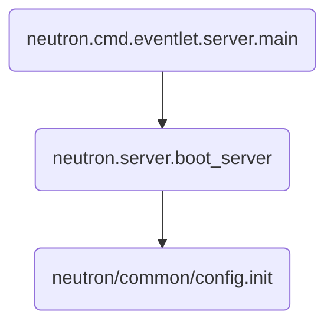

## neutron配置文件
neutron启动中两个重要的配置文件，分别为

- neutron.conf
- ml2_conf.ini

其中定义了若干个组，比如
- neutron.conf中的DEFAULT，nova，databas组等
- ml2_conf.ini中的ml2，ml2_type_vlan，ovs组等

这些组中都有若干个参数，这里不一一解释，后面章节的解析中会逐渐将参数的解析结合业务功能纳入进来


## neutron 注册参数
neutron代码中注册参数是通过不同的模块代码进行注册的，比如ml2相关的参数，是通过neutron/plugins/ml2/config.py文件进行注册的，大致如下

```python
ml2_opts = [
    cfg.ListOpt('type_drivers',
                default=['local', 'flat', 'vlan', 'gre', 'vxlan', 'geneve'],
                help=_("List of network type driver entrypoints to be loaded "
                       "from the neutron.ml2.type_drivers namespace.")),
    cfg.ListOpt('tenant_network_types',
                default=['local'],
                help=_("Ordered list of network_types to allocate as tenant "
                       "networks. The default value 'local' is useful for "
                       "single-box testing but provides no connectivity "
                       "between hosts.")),
    # ...                   
]

cfg.CONF.register_opts(ml2_opts, "ml2")
```
- 这里定义了一组参数，注册的group名为ml2


其他部分组的注册位置：
- DEFAULT：neutron/conf/common.py
- nova：neutron/conf/common.py
- ovs:neutron/conf/plugins/ml2/drivers/ovs_conf.py
- securitygroup:neutron/conf/agent/securitygroups_rpc.py
- ml2_type_vlan、ml2_type_vxlan、ml2_type_geneve、ml2_type_flat、ml2_type_gre：neutron/conf/plugins/ml2/drivers/driver_type.py


以上列举了一部分重要的组，还有一些组是通过插件的形式或者调用库的形式注册进来的，比如keystone_authtoken组是通过import keystone库进行注册，ovn组是通过mechanism plugin方式进行注册

## neutron传递命令行流程



```
def init(args, **kwargs):
    cfg.CONF(args=args, project='neutron',
             version='%%(prog)s %s' % version.version_info.release_string(),
             **kwargs)

```
- args = sys.argv[1:]

