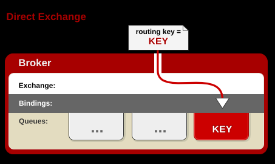
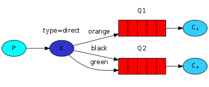
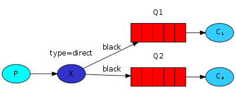
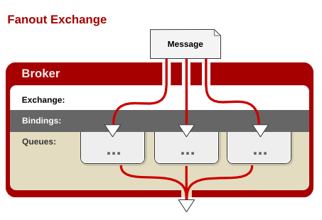
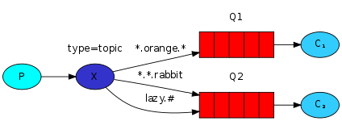

oslo-messaging是openstack官方的一个重要的rpc库，他利用ampq协议构建了一套远程过程调用的框架

使用oslo-messaging库，我们可以很快构建出来一套基于rpc调用的服务

# RPC
远程过程调用（英语：Remote Procedure Call，缩写为 RPC）是一个计算机通信协议。该协议允许运行于一台计算机的程序调用另一台计算机的子程序，而程序员无需额外地为这个交互作用编程。

与远程过程调用相对的是本地过程调用，通俗的来讲，同一个进程中的调用，我们称为本地调用，方法为直接调用全局函数或者类函数，对于编译运行的语言，这种调用在程序编译期就已经明确了所调用目标的函数指针，以及函数的方法与过程

而远程过程调用，则是通过构建在tcp协议以上的协议，如amqp协议，http协议等通过网络传递调用信息到远端，由远端程序响应后执行相应的操作，返回对应的结果的一种调用方法

使用rpc，你可以像调用本地函数一样调用远端的函数，在分布式，云计算，微服务等领域具有不可替代的作用

# AMQP协议
AMQP，即Advanced Message Queuing Protocol,一个提供统一消息服务的应用层标准高级消息队列协议,是应用层协议的一个开放标准,为面向消息的中间件设计。基于此协议的客户端与消息中间件可传递消息，并不受客户端/中间件不同产品，不同的开发语言等条件的限制。

其设计目标是对于消息的排序、路由（包括点对点和订阅-发布）、保持可靠性、保证安全性[1]。高级消息队列协议保证了由不同提供商发行的客户端之间的互操作性。

# RabbitMQ

## 介绍
RabbitMQ是一个在AMQP（Advanced Message Queuing Protocol ）基础上实现的，可复用的企业消息系统。它可以用于大型软件系统各个模块之间的高效通信，支持高并发，支持可扩展。

> RabbitMQ is a message broker: it accepts and forwards messages. You can think about it as a post office: when you put the mail that you want posting in a post box, you can be sure that Mr. or Ms. Mailperson will eventually deliver the mail to your recipient. In this analogy, RabbitMQ is a post box, a post office and a postman.

以上这段是官网对于rabbitmq形象的比喻，大致意为RabbitMQ是一个消息代理者，它接收消息并且转发消息。你可以将其视为邮局：你投递邮件到邮箱时，你能确定邮递员最终一定会将邮件送达到你的收件人。在这个类比中，RabbitMQ即是邮箱，又是邮局，又是邮递员

## RabbitMQ中重要的概念

- Broker: 指消息队列所在服务器实体
- Exchange：消息交换机，用于路由消息（消息发给exchange，exchange发给对应的queue）
- Queue：消息队列，消息的载体，接收Exchange发送过来的消息
- Routing Key：路由关键字，消息根据路由关键字进行转发，类似于map中的key，根据key找到value（消息队列）
- producer：消息生产者，即发送消息的一放，创建消息，发送消息
- consumer：消息消费者，即接收消息的一放
- channel：消息通道，在客户端的每个连接里，可建立多个channel，每个channel代表一个会话任务。

### Exchange类型
exchange有四种类型，分别为fanout,direct,topic,header，其中常用的三种为fanout,direct,topic，而header在实际应用中较少出现，所以这里只介绍常用的三种类型

#### Direct Exchange

这个模式下的Exchange，需要binding
key绑定queue（可以绑定一个或多个queue），收到消息时，exchange会根据routing
key转发到与其绑定的所有queue中，如果没有绑定的queue，则消息丢弃

Binding_key对queue的绑定可以一对一，也可以一对多，看以下两个例子

##### 一对一绑定

在这个例子中，Exchange x上三个binding key:orange,black,green 均只绑定了一个queue

当x收到带有routing key为orange的消息时，将消息路由到Q1上

当x收到带有routing key为black或green的消息时，将消息路由到Q2上

##### 一对多绑定

在这个例子中，Exchange x上一个binding key：black 绑定了两个queue

当x收到带有routing key为black的消息时，将消息投递到Q1和Q2上

#### Fanout Exchange

这种类型的Exchange不需要binding_key与queue的绑定，exchange会将收到的消息广播到每一个queue中

在这种模式下，生产值只需要产生消息并发送到exchange，则每个与此exchange绑定的queue都会收到消息，实现一个消息被多个消费者获取的目的

### Topic Exchange

这种模式与direct模式有一些类似，均为通过key进行消息路由，但是这种key的匹配支持模糊匹配，即可以通过过滤routing key中的某些关键字来进行路由

匹配规则如下：
- *只能替换匹配一个单词
- #能替换匹配0到多个单词

在这个例子中，我们要发送一些描述动物的消息，这些被发送的消息的routing_key 由三个单词（两个"."）组成， "<speed>.<colour>.<species>".

"*.orange.*"绑定Q1 （所有三个单词的，中间单词是“orange”的消息都会发送到Q1）

"*.*.rabbit" 和"lazy.#".绑定Q2（三个单词的以rabbit结尾的消息和以lazy开头的多个单词都会发送到Q2）

"quick.orange.rabbit" 发送到Q1和Q2

"lazy.orange.elephant" 发送到Q1和Q2

"quick.orange.fox" 发送到Q1

"lazy.brown.fox" 发送到Q2

"lazy.pink.rabbit" 发送到Q2（匹配两个binding_key,但是这两个bindling_key 都绑定的是Q2）

"quick.brown.fox" 不匹配，这条消息会被丢弃

特殊情况：

一个单词:"orange",不匹配被丢弃

四个单词:"quick.orange.male.rabbit",不匹配被丢弃

"lazy.orange.male.rabbit"匹配"lazy.#",发送到Q2

当一个queue用"#"绑定时，将会收到所有的消息,如果不考虑routing_key基本和 fanout exchange一样

当queue既不用"*" 也不用"#"绑定时，那topic exchange基本和direct一样