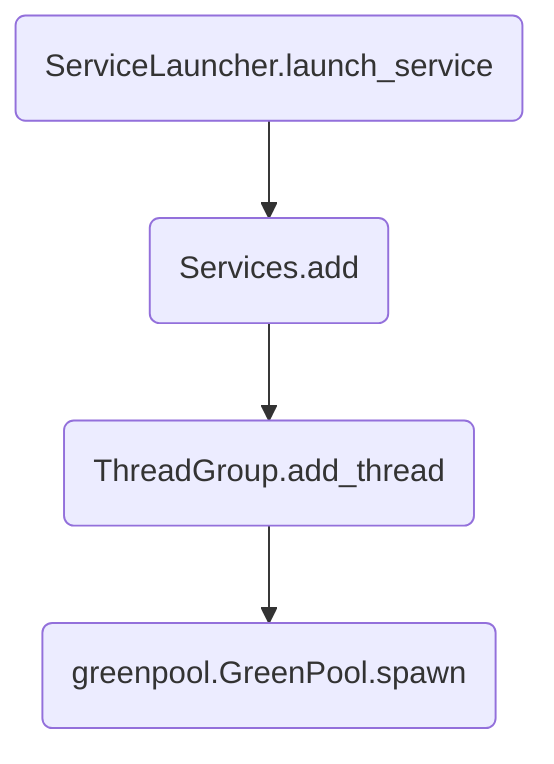

# 源码解析

上节讲解oslo-service用法时提到，oslo-service是对eventlet.wsgi和PasteDeploy进行的封装，我们本章进行源码解析的前提条件，是以黑盒的方式看待eventlet.wsgi和PasteDeploy，通过讲解oslo-service对这两个库的封装和调用的方式来解析源码

## 对eventlet.wsgi的封装

### eventlet.wsgi两个关键步骤
回头看一下eventlet.wsgi章节的代码，启动代码如下

```python
from eventlet import wsgi
import eventlet

def hello_world(env, start_response):
    start_response('200 OK', [('Content-Type', 'text/plain')])
    return ['Hello, World!\r\n']

sock = eventlet.listen(('', 8090))
wsgi.server(sock=sock, site=hello_world)
```

关键步骤只有两行代码，分别为
- 通过eventlet.listen创建监听socket
- 通过wsgi.server创建wsgi server

### oslo-service创建socket

在初始化oslo-service时，我们用到了如下代码创建了一个server
```
server = oslo_service.wsgi.Server(conf=cfg.CONF,name="pdl",app=app,host='127.0.0.1',port=8090)
```

在wsgi.Server类的__init__函数中，对socket进行了初始化

```python
# oslo_service/wsgi.py
import socket

class Server(service.ServiceBase):
    def __init__(self, conf, name, app, host='0.0.0.0', port=0,socket_family=None):
        # ...
        if not socket_family or socket_family in [socket.AF_INET,
                                                  socket.AF_INET6]:
            self.socket = self._get_socket(host, port, backlog)
        # ...
        
    def _get_socket(self, host, port, backlog):
        bind_addr = (host, port)
        info = socket.getaddrinfo(bind_addr[0],
                                      bind_addr[1],
                                      socket.AF_UNSPEC,
                                      socket.SOCK_STREAM)[0]
        family = info[0]
        bind_addr = info[-1]
        
        # ...
        sock = eventlet.listen(bind_addr, family, backlog=backlog)
        # ...
        return sock
```

- 初始化Server是，传入了host和port
- 通过调用_get_socket函数创建了socket

### oslo-service创建wsgi server

创建wsgi server用到了如下两个函数
```
service_launcher = service.ServiceLauncher(cfg.CONF)
service_launcher.launch_service(server)
``` 

- 创建了一个ServiceLauncher类的launcher
- 调用launch_service函数启动服务



```
gt = self.pool.spawn(callback, *args, **kwargs)
```
通过greenpool创建了一个线程，线程函数callback为Services.run_service,参数为上一步创建的wsgi.Server

```python
class Services(object):
    @staticmethod
    def run_service(service, done):
        service.start()
```
这里调用到了wsgi.Server的star函数

```python
class Server(service.ServiceBase):
    def start(self):
        self.dup_socket = self.socket.dup()
        # ...
        wsgi_kwargs = {
            'func': eventlet.wsgi.server,
            'sock': self.dup_socket,
            'site': self.app,
            'protocol': self._protocol,
            'custom_pool': self._pool,
            'log': self._logger,
            'log_format': self.conf.wsgi_log_format,
            'debug': False,
            'keepalive': self.conf.wsgi_keep_alive,
            'socket_timeout': self.client_socket_timeout
            }
        # ...
        self._server = eventlet.spawn(**wsgi_kwargs)    
```
- 先duplicate一份socket，为什么要做这一步，原因如下

> 因为每个已打开的文件，在内核中都会用一个file结构体来表示，file结构体中有一个属性为f_count，表示当前文件的引用计数，如果调用close，引用计数会减一，如果引用计数变为0，则内核会释放此文件，达到真正的关闭文件
> 所以这里先dup，仅仅为如果有其他地方同样用到了此socket，先dup一下，让文件计数+1，则无论哪一方先关闭了socket，都不会让内核释放已打开的文件

- 利用eventlet.spawn创建一个green thread，其中线程体为eventlet.wsgi.server

> 注：简单说一下**wsgi_kwargs，免得有写对pyhton不是很熟的小伙伴看不懂这里，**+变量表示将字典展开，要求变量一定是字典，展开之后会变成多个属性，比如d={'name':'jack','age':10}
> 则**d会被展开为(name='jack',age=10),所以**wsgi_kwargs会直接变为eventlet.spawn的实参进行调用


## 对PasteDeploy的封装
回顾PasteDeploy的启动过程，可以总结为一下两个关键步骤
1. 通过paste.deploy.loadapp函数加载配置文件，创建app
2. 将app注册进wsgi server

```
wsgi_app = loadapp("config:%s" % os.path.abspath(configfile), appname)
wsgi.server(eventlet.listen(('', 8090)), wsgi_app)
```

本节将针对这两个关键步骤进行分析

### loadapp
oslo-service中loadapp调用过程如下

```
    cfg.CONF(args=sys.argv[1:])
    loader = oslo_service.wsgi.Loader(cfg.CONF)
    app = loader.load_app('pdl')
```

- cfg.CONF初始化配置文件，相关详细讲解请查看oslo-config章节的教程
- 初始化Loader对象

```python
# oslo_service/wsgi.py
class Loader(object):
    def __init__(self, conf):
        conf.register_opts(_options.wsgi_opts)
        self.config_path = conf.api_paste_config
        # ...
        
```
初始化过程比较简单，首先注册了一下wsgi相关的参数，其中包括'api_paste_config'参数，这个参数也配置到了配置文件中，指向pastedeploy配置文件，然后保存了配置文件的路径

- 调用loader.load_app创建applicatioin

```
# oslo_service/wsgi.py
class Loader(object):
    def load_app(self, name):
        return deploy.loadapp("config:%s" % self.config_path, name=name)
```

此处仅仅是对pastedeploy loadapp简单的封装

### 创建wsgi server
在server初始化时，传入了上一步load出的app，保存在server的self.app中

```python
# oslo_service/wsgi.py

class Server(service.ServiceBase):
    def __init__(self, conf, name, app, host='0.0.0.0', port=0,socket_family=None):
        # ...
            self.app = app
        # ...
    
```

Server.start函数中，通过wsgi_kwargs的site参数，将app传递给了eventlet.wsgi.server

```python
class Server(service.ServiceBase):
    def start(self):
        self.dup_socket = self.socket.dup()
        # ...
        wsgi_kwargs = {
            'func': eventlet.wsgi.server,
            'sock': self.dup_socket,
            'site': self.app,
            #...
            }
        # ...
        self._server = eventlet.spawn(**wsgi_kwargs)    
```

## 小结
通过上一章的解析，将oslo-service如何封装pastedeploy和eventlet.wsgi进行了源码层面的分析


