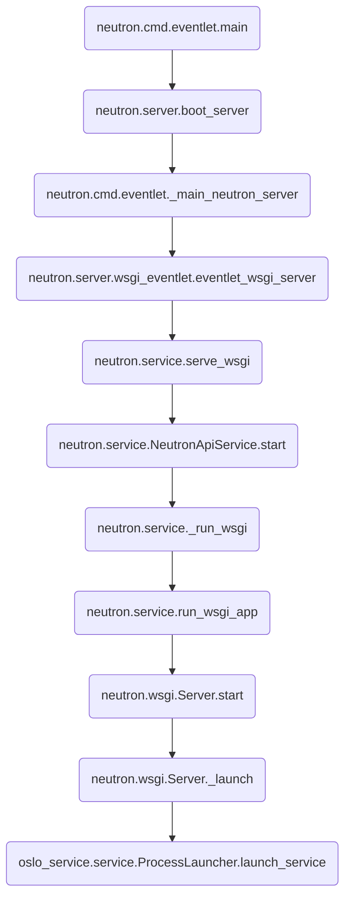

# neutron与oslo-service
上面的章节进行了oslo-service用法和源码的解析，本章讲解在neutron中，是如何通过oslo-service创建resetful
api server的


## neutron Server
neutron中定义了一个wsgi server类，位置在neutron/wsgi.py

```python
# neutron/wsgi.py
class Server(object):
    def __init__(self, name, num_threads=None, disable_ssl=False):
        # ...
        self.pool = eventlet.GreenPool(1)
        self.name = name
        # ...
```
初始化时传入了一些参数，包括Server
name表示服务名，num_threads表示启动线程的个数，disable_ssl表示其否启用ssl等

再看它对oslo-service调用的封装

```python
def start(self, application, port, host='0.0.0.0', workers=0):
    self._host = host
    self._port = port
    backlog = CONF.backlog

    self._socket = self._get_socket(self._host,
                                    self._port,
                                    backlog=backlog)

    self._launch(application, workers)
```
首先通过_get_socket创建eventlet监听的socket

```python
def _get_socket(self, host, port, backlog):
    bind_addr = (host, port)
    # ... 
    sock = eventlet.listen(bind_addr,
                           backlog=backlog,
                           family=family)
    # ...
    return sock                       
```

然后通过oslo-service的ProcessLaunch启动服务

```python
from oslo_service import service as common_service
def _launch(self, application, workers=0):
    service = WorkerService(self, application, self.disable_ssl, workers)
    # ...
    self._server = common_service.ProcessLauncher(cfg.CONF,
                                                  wait_interval=1.0)
    self._server.launch_service(service,
                                workers=service.worker_process_count)
```
关于WorkerService会在下一节进行解析，这里可以先认为是一个可launch的wsgi
service

通过创建ProcessLauncher并调用launch_service的方式启动wsgi服务，这一步在之前章节有讲解，这里不再进行介绍


## neutron WorkerService
在oslo-service章节中，我们讲到了创建server是这样创建的

```
server = oslo_service.wsgi.Server(conf=cfg.CONF,name="pdl",app=app,host='127.0.0.1',port=8090)
```

oslo_service.wsgi.Server是oslo-service框架的一个内置类，它继承自oslo_service.service.ServiceBase

oslo_service.service.ServiceBase是一个抽象类，定义了四个抽象方法，分别为start，stop，wait，reset

如果内置的Server类不能满足用户的需要，可以通过实现ServiceBase抽象接口的方法来实现自己的Service类

在neutron中，即实现了自己的Service类，他的继承层次如下

```python
from oslo_service import service

class NeutronWorker(service.ServiceBase):
    pass

class WorkerService(NeutronWorker):
    pass

```

我们这里着重讲解一下WorkerService这个类

```python
# neutron/wsgi.py

class WorkerService(neutron_worker.NeutronWorker):
    def __init__(self, service, application, disable_ssl=False,
                 worker_process_count=0):
        super(WorkerService, self).__init__(worker_process_count)

        self._service = service
        self._application = application
        self._disable_ssl = disable_ssl
        self._server = None         

```
init函数传入了启动service必要的一些参数，包括
- service为上一节的Server对象，后面会用到其中保存的socket对象
- application 为通过pastedeploy加载的app

在上面的章节知道了，service启动会调用到其start函数

```python
class WorkerService(neutron_worker.NeutronWorker):
    def start(self):
        # ...
        dup_sock = self._service._socket.dup()
        self._server = self._service.pool.spawn(self._service._run,
                                                self._application,
                                                dup_sock)
```
照例先dup一下socket，原因请看上一章的讲解

然后调用了self._service._run，这里的self._service为上一节介绍的neutron.wsgi.Server类，我们看他的_run函数

```python
class Server(object):
        def _run(self, application, socket):
        eventlet.wsgi.server(socket, application,
                             max_size=self.num_threads,
                             log=LOG,
                             keepalive=CONF.wsgi_keep_alive,
                             socket_timeout=self.client_socket_timeout)
```
看到这个调用已经非常熟悉了，就是eventlet.wsgi章节讲解的server

> 小结：Neutron并没有直接调用oslo-service内置的server类，而是自己实现了一个简化版的server，直接封装了eventlet.wsgi，结合oslo-service章节对eventlet封装的分析，这段代码就很容易理解了


## neutron wsgi service
neutron中定义了一个WsgiService类，这个类的定义如下

```python
# neutron/service.py
class WsgiService(object):
    def __init__(self, app_name):
        self.app_name = app_name
        self.wsgi_app = None
    
    def start(self):
        self.wsgi_app = _run_wsgi(self.app_name)

    def wait(self):
        self.wsgi_app.wait()    
```
这个类的__init__函数中初始化了两个变量，一个为app_name，一个为wsgi_app，通过这两个变量我们也能够猜测到，这个类就是一个将wsgi和app进行包装的类

他的start函数中调用了一个本地私有函数_run_wsgi

```python
def _run_wsgi(app_name):
    app = config.load_paste_app(app_name)
    run_wsgi_app(app)
```

_run_wsgi中，load了pastedeploy的app，这里不再做详细展开

然后调用了run_wsgi_app函数

```python
def run_wsgi_app(app):
    server = wsgi.Server("Neutron")
    server.start(app, cfg.CONF.bind_port, cfg.CONF.bind_host,
                 workers=_get_api_workers())
    return server             
```
wsgi.Server即我们上面降到的Server类，这里进行了初始化

然后调用了server的start函数启动wsgi service

# 流程图
从neutron启动到wsgi server启动成功，流程图是这样的

