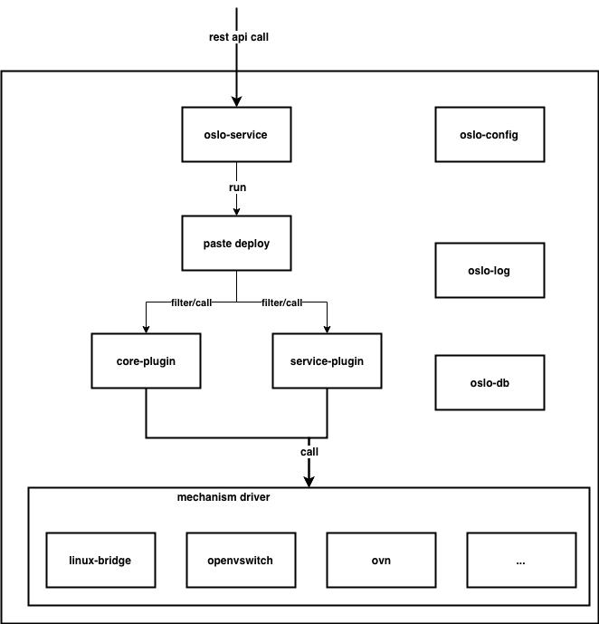

# 序章

## neutron中的模块关系
本书主要通过如下列举的模块进行分析，各模块的关系和功能如下所示

- oslo-service: 负责创建wsgi服务，接收restful api的调用
- paste deploy: 对restful
  api进行过滤，调用对应的后端函数，其中包括token校验，校验成功后，调用到core-plugin对应的函数
- core-plugin: ml2业务代码入口，包括network、subnet、port的处理
- service-plugin: 其他业务的代码入口，如l3层的router、floating ip、security
  group 操作等
- mechanism
  driver:底层sdn实现的技术，目前主流的技术有linux-bridge,openvswitch,ovn等
- oslo-config: 配置文件解析
- oslo-log:日志处理
- oslo-db:数据库处理
